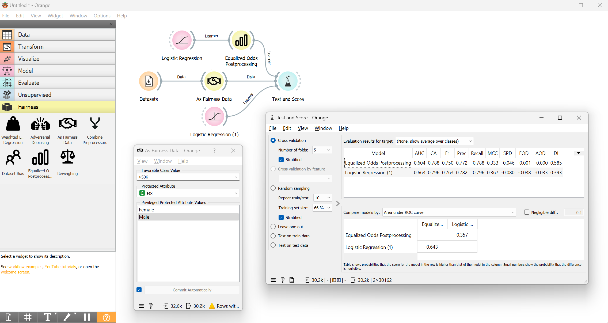

<h1 align="center">Orange3-Fairness</h1>

Orange3 Fairness is an add-on for the [Orange3](http://orangedatamining.com/) data mining suite. 
It provides extensions for fairness-aware AI, which includes algorithms for detecting and mitigating 
different types of biases in the data and the predictions of machine learning models. 

# Easy installation

1. [Download](https://orangedatamining.com/download/) the latest Orange release from
our website.
2. Install the the fairness add-on: head to
`Options -> Add-ons...` in the menu bar. From the list of add-ons, select Fairness and confirm the installation.

# For developers

If you would like to install from cloned git repository, run

    pip install .

To register this add-on with Orange, but keep the code in the development directory
(do not copy it to Python's site-packages directory), run

    pip install -e .

###  Usage

After the installation, the widget from this add-on is registered with Orange. To run Orange from the terminal,
use

    orange-canvas

or

    python -m Orange.canvas

The new widget appears in the toolbox bar under the section Fairness.
Starting up for the first time may take a while.
