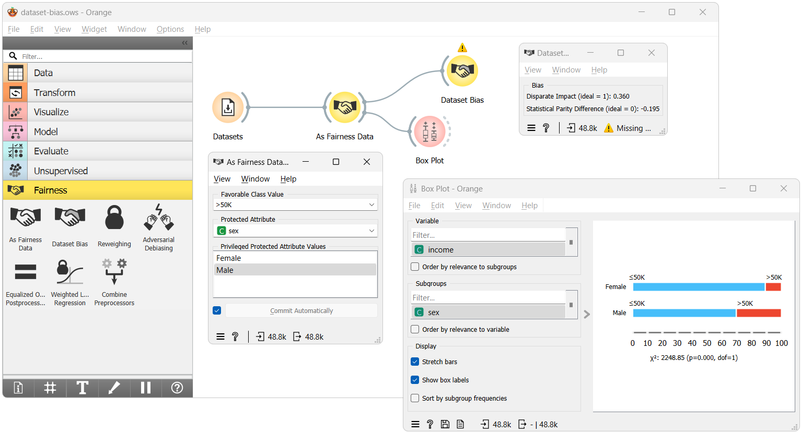
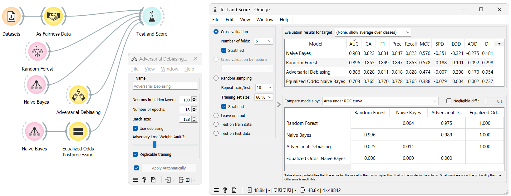
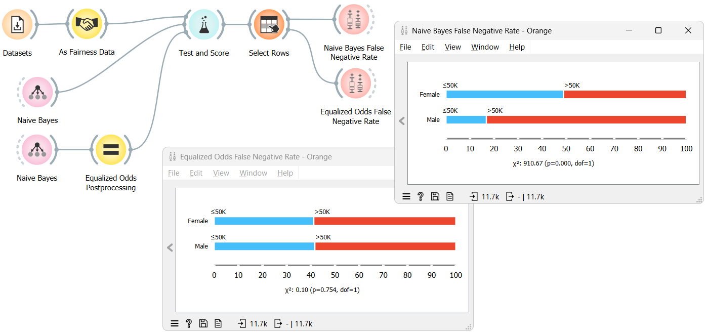

Orange3 Fairness Add-On
========================

**Orange3 Fairness** is an add-on for the `Orange Data Mining <http://orangedatamining.com>`_ software. Orange3 is a data mining and machine learning software suite featuring interactive data visualization, data pre-processing and feature selection, and a variety of learning algorithms.

The Fairness add-on extends Orange3 with tools for fairness-aware AI, which includes algorithms for detecting and mitigating different types of biases in the data and in the predictions of machine learning models.

Installation
------------

1. `Download <https://orangedatamining.com/download/>`_ the latest Orange release from our website.
2. Install the fairness add-on: head to
   ``Options -> Add-ons...`` in the menu bar. From the list of add-ons, select Fairness and confirm.
   This will download and install the add-on and its dependencies.

Usage
-----

After the installation, the widgets from this add-on are added to Orange. To use them, run Orange. The new widgets appear in the toolbox bar under the section Fairness.

For an introduction to Orange, see the following YouTube playlist:

* `Intro to Data Science <https://www.youtube.com/watch?v=H1ibqB_cvlE&list=PLmNPvQr9Tf-b_SuBdoRsuNhTmaHJ0eKab>`_ - introduces data analysis with Orange

For more on using widgets from the Fairness add-on, see the following:

* `Orange blog series on Fairness <https://orangedatamining.com/blog/?tag=fairness>`_
* `Orange Fairness workflow examples <https://orangedatamining.com/examples/?tag=Fairness>`_
* `Orange widget catalog <https://orange.biolab.si/toolbox/>`_ - Orange widgets documentation

Examples
--------

Dataset Bias Examination
~~~~~~~~~~~~~~~~~~~~~~~~

Understanding the potential biases within datasets is crucial for fair machine-learning outcomes. This workflow detects dataset bias using a straightforward algorithm. After loading the dataset, we add specific fairness attributes to it, which are essential for our calculations. We then compute the fairness metrics via the Dataset Bias widget and visualize the results in a Box Plot.

More information: see blog on `Dataset Bias <https://orangedatamining.com/blog/orange-fairness-dataset-bias/>`_

Fairness-aware Models
~~~~~~~~~~~~~~~~~~~~~

If the data we use is biased, the models we train on it will perpetuate that bias. This is where fairness-aware models come in. In this workflow, we use four models, two of which are fairness-aware, to predict the outcome of the Adult dataset. Using the Test and Score widget, we can compare the fairness metrics of the models and see how they perform on the dataset.

More information: see blog on `Adversarial Debiasing <https://orangedatamining.com/blog/orange-fairness-adversarial-debiasing/>`_, `Equal Odds Postprocessing <https://orangedatamining.com/blog/orange-fairness-equal-odds-postprocessing/>`_ or `Reweighing <https://orangedatamining.com/blog/orange-fairness-reweighing-as-a-preprocessor/>`_

Fairness Visualization
~~~~~~~~~~~~~~~~~~~~~~

Sometimes, it is hard to understand the bias in the data by looking at the numbers. This is where visualization comes in. In this workflow, we use Box Plots to visualize and compare the bias in the predictions of a fairness-aware and a regular model. The visualization shows the difference in the false-negative and true-positive rates for the two models.

More information: see blog on `Equal Odds Postprocessing <https://orangedatamining.com/blog/orange-fairness-equal-odds-postprocessing/>`_ or `Why Removing Features is Not Enough <https://orangedatamining.com/blog/why-removing-features-isnt-enough/>`_

Widgets
-------------------

The following widgets are included in the Fairness add-on:

.. toctree::
   :maxdepth: 1

   widgets/as-fairness-data
   widgets/dataset-bias
   widgets/reweighing
   widgets/adversarial-debiasing
   widgets/equalized-odds-postprocessing
   widgets/weighted-logistic-regression
   widgets/combine-preprocessors

For developers
--------------

Installing from downloaded code
~~~~~~~~~~~~~~~~~~~~~~~~~~~~~~~

If you would like to install from a cloned git repository, run

.. code-block:: bash

    pip install .

Installing in editable mode
~~~~~~~~~~~~~~~~~~~~~~~~~~~

To register this add-on with Orange, but keep the code in the development directory (do not copy it to Python's site-packages directory), run

.. code-block:: bash

    pip install -e .

To run Orange from the terminal, use

.. code-block:: bash

    orange-canvas
